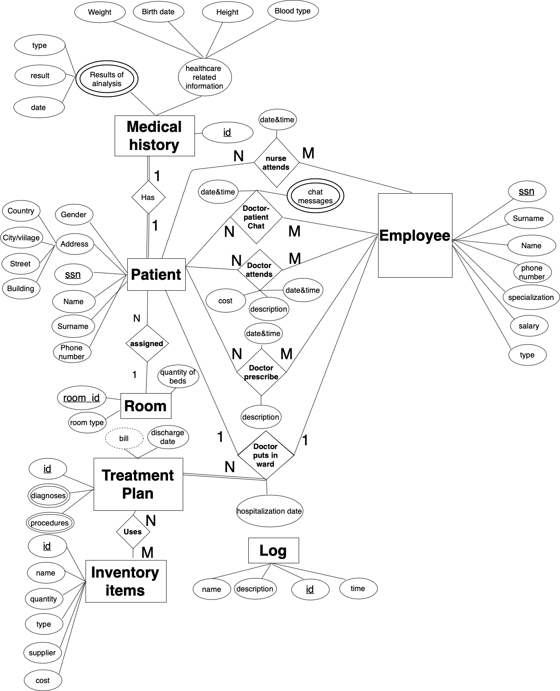

# INNO-F19-DMD

Innopolis University fall 2019 Data Modelling and Databases course project.
Developed by:

- [Andrey Feygelman](https://github.com/Andrey862)
- [Ivan Abramov](https://github.com/TopIvanAbramov)
- [Magomed Magomedov](https://github.com/alkaitagi)

## Annotation

Our system is designed for full data management of a hospital with special focus on its
inpatient (ward) department. The system has several subsystems, each of which designated for
its real-word counterpart.

Authentication system through which users (patients, medical personnel and administrators)
can log in or log on (with the help of an administrator). Depending on an account type provided
of the system, patients can edit their basic info and view their appointments, doctors can view
and edit appointments and as well as have access to medical history of each particular patient,
and administrators can manage personal and view other systems data.

Internal communication system requires authentication and includes chat (patient-doctor,
doctor-doctor), notice board (important announcements) and appointments view.

Treatment is where the main interactions between patient and medical personnel happen,
stored, and subsequently are being compiled into patients’ medical history. The examples of
records are prescriptions, medications given and reports from medical examinations which
might include results of lab analysis.

Treatment includes the whole inpatient care department management system. Patients under
inpatient care has their whole treatment process information there (timespan during which they
were under the ward, treatment plan, treatment result etc.).

Inpatient care is tightly integrated with inventory system, that automatically tracks amount of
medications available (and provided), beds occupied, meal plan provided. This system is also
capable of giving analytical data of usage of resources.

Payment system is responsible for tracking cost of all services provided by the hospital,
composing them into a single bill, and accepting various payment methods, such as cash, credit
card or even payments from insurance company

Risk description:

- Critical (C) It will break the main functionality of the system. The system cannot be used if this
requirement is not implemented.
- High (H) It will impact the main functionality of the system. Some function of the system could
be inaccessible, but the system can be generally used.
- Medium (M) It will impact some system features, but not the main functionality. The system
can still be used with some limitations.
- Low (L) The system can be used without limitation, but with some workarounds.

## Entity-relationship model

